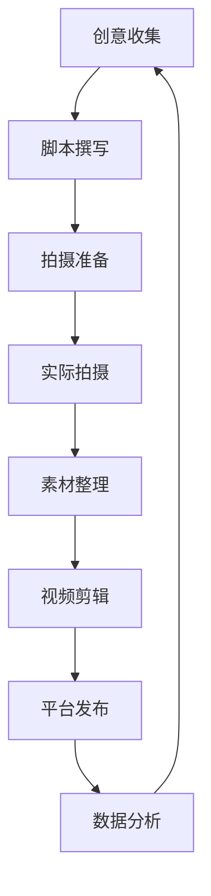

# 内容创作流程规范

## 1. 时间安排规范
根据创作者可用时间制定以下标准流程：

### 1.1 每日时间分配
| 时间段 | 可用时长 | 推荐工作内容 |
|--------|---------|-------------|
| 12:00-13:00 | 60分钟 | 快速拍摄、素材整理 |
| 18:00-19:00 | 60分钟 | 内容剪辑、平台互动 |
| 21:30-00:00 | 150分钟 | 创意构思、脚本撰写、深度剪辑 |

### 1.2 每周时间规划
- 周日21:30-23:00：制定下周内容计划
- 工作日中午：执行2-3次快速拍摄
- 周六21:30-23:00：数据复盘与优化

## 2. 内容生产标准流程

## 3. 质量控制标准
### 3.1 拍摄要求
- 每个动作至少3个不同角度（全景、中景、特写）
- 单日拍摄素材不少于30分钟原始素材
- 光线要求：优先使用自然光，补光需柔和均匀

### 3.2 剪辑标准
- 短视频：30秒-1分钟，快节奏剪辑
- 长视频：2-3分钟，适当保留自然状态
- 转场效果：硬切不超过0.5秒

## 4. 文件命名规范
- 原始素材：`日期_内容简述_序号`，如`20250812_仙仙玩球_001`
- 剪辑成品：`发布日期_平台_内容主题`，如`20250813_抖音_仙仙的早餐时光`
- 脚本文件：按`.clinerules/scrypt-rules.md`规范命名

## 5. 素材管理
1. 原始素材按日期存放在`assets/raw/年-月/年-月-日`
2. 剪辑成品存放在`assets/final/平台名称/年-月`
3. 每周日清理无效素材
